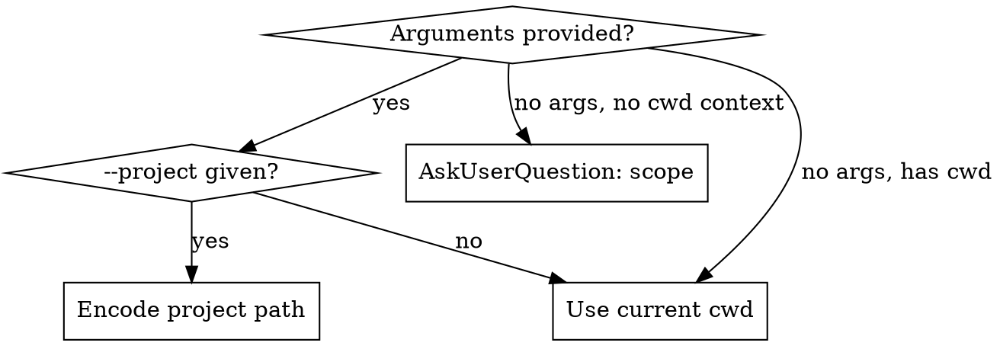

# Session Decisions

Extract technical decisions and deliberations from Claude Code session history, organized for resume and portfolio use.

**Two-stage output**: Decision Log (default) → STAR Format (optional)

---

## Arguments

```
(all optional)
--project <name>    Filter by project (partial path match)
--from <YYYY-MM-DD> Start date
--to <YYYY-MM-DD>   End date
--star              Additionally generate STAR format transformation
--all               Include ALL decisions (default: user-driven only)

Default: current project, all dates, user-driven decisions only
```

---

## Execution Algorithm

### Step 1: Scope Selection [MANDATORY]



**Path Encoding**: `/Users/admin/Workspace/Socar` → `-Users-admin-Workspace-Socar`

For partial project names, fuzzy match against `~/.claude/projects/`:
```bash
ls ~/.claude/projects/ | grep -i "<project-name>"
```

### Step 2: Find Session Files

```bash
PROJECT_DIR="$HOME/.claude/projects/<encoded-cwd>"
# Exclude subagent session files — only analyze main session conversations
SESSION_FILES=$(find "$PROJECT_DIR" -maxdepth 1 -name "*.jsonl" -type f 2>/dev/null)

# Date filtering (macOS) — use file modification time
for f in $SESSION_FILES; do
  MTIME=$(stat -f "%Sm" -t "%Y-%m-%d" "$f")
  # Keep only files within --from/--to range
done
```

**Note**: Use `-maxdepth 1` to exclude `subagents/` directory. Subagent sessions are spawned by main sessions and rarely contain independent decision-making.

**Decision Tree:**
```
Session files found?
├─ No → "No sessions found. Check project name or date range."
└─ Yes → How many?
    ├─ 1-5 files  → Skip to Phase 2 (deep analyze all)
    ├─ 6-50 files → Funnel Pipeline (Phase 1 scan → Phase 2 select)
    └─ 50+ files  → Warn + limit to recent 20 (confirm via AskUserQuestion)
```

### Step 3: Phase 1 - Decision Signal Scan

> Only runs for 6+ sessions. For 1-5, skip directly to Phase 2.

Extract each session's **first message** (display text) from `history.jsonl`, then score conversations for decision keywords.

```bash
# Extract session preview from history.jsonl
jq -r 'select(.sessionId == "SESSION_ID") | .display' ~/.claude/history.jsonl | head -1

# Extract conversation + keyword scoring per session
EXTRACT_SCRIPT="$HOME/.claude/plugins/cache/team-attention-plugins/session-wrap/1.0.0/skills/history-insight/scripts/extract-session.sh"

for session in $SESSION_FILES; do
  # Extract conversation (removes 94% metadata)
  EXTRACTED=$("$EXTRACT_SCRIPT" "$session" 2>/dev/null || echo '{"messages":[]}')

  # Get message count for normalization
  MSG_COUNT=$(echo "$EXTRACTED" | jq '.message_count // 1')

  # Keyword scoring — pipe through `strings` to handle control characters in JSONL
  RAW_SCORE=$(echo "$EXTRACTED" | strings | \
    grep -ciE 'architect|design|pattern|versus|vs|tradeoff|migration|instead|constraint|workaround|refactor|performance|optimize|compare|alternative|approach' || echo 0)

  # Normalize: score per 10 messages (avoids longer sessions dominating)
  NORM_SCORE=$((RAW_SCORE * 10 / MSG_COUNT))
done
```

**Important**: Real session JSONL files often contain control characters (U+0000-U+001F) that cause `jq` parse failures in the text-joining pipeline. Always pipe through `strings` before `grep` for the keyword scoring step.

**Signal Classification** (details: `${baseDir}/references/decision-heuristics.md`):
- **HIGH (normalized 5+)**: Target for deep analysis
- **MEDIUM (normalized 2-4)**: Include if fewer than 10 HIGH sessions
- **LOW/NONE (normalized 0-1)**: Skip

### Step 4: Phase 2 - Deep Decision Extraction

Analyze full conversations from HIGH-signal sessions (up to 10).

#### Step 4a: User Attribution Analysis [CRITICAL]

**Default behavior extracts ONLY user-driven decisions.** Use `--all` to include Claude-proposed decisions.

For each session, separate `role: "human"` messages from `role: "assistant"` messages. Only `human` messages determine attribution.

**Attribution Classification** (details: `${baseDir}/references/decision-heuristics.md`):

| Attribution | Signal in User Messages | Include by Default? |
|---|---|---|
| **User-Directed** | User chose between options, specified approach, named a reference | YES |
| **User-Rejected** | User rejected Claude's proposal, requested revision | YES |
| **User-Feedback** | User corrected direction mid-implementation | YES |
| **Claude-Proposed** | Claude suggested, user only approved ("ㅇㅇ", "좋아", "진행해") | NO (needs `--all`) |
| **Claude-Autonomous** | Claude decided without user input during implementation | NO (needs `--all`) |

**User-driven decision signals in `role: "human"` messages:**
- Explicit choice: "A로 해", "이걸로", "2번", selecting from presented options
- Rejection: "그거 말고", "다시", "아니", "이건 아닌 것 같아"
- Direction: "~처럼 해", "~를 참고해", "~패턴 써", "~방식으로"
- Correction: "이게 아니라", "~로 바꿔", modifying Claude's output
- Specification: naming a specific pattern, library, convention, or reference

**NOT user decisions (exclude by default):**
- Simple task delegation: "~해줘" without specifying how
- Passive approval: "ㅇㅇ", "좋아", "진행해", "ㄱㄱ"
- Claude's own technical choices during implementation

#### Step 4b: Decision Point Extraction

**Conversation patterns to detect:**
1. **Question-Exploration-Conclusion**: Question asked → alternatives explored → conclusion reached
2. **Rejection-Revision loop**: First approach fails → alternative chosen
3. **Pros/Cons enumeration**: Explicit listing of advantages and disadvantages
4. **"Instead"/"Rather" markers**: Expressions indicating choice between alternatives

**Extract from each decision point:**
- **Context**: What problem was being solved?
- **Options Considered**: What alternatives were discussed?
- **Decision**: What was chosen?
- **Rationale**: Why was this chosen over alternatives?
- **Outcome**: What was the result? (if visible in session)
- **Technical Details**: Specific technologies, patterns, API names
- **User Quote**: Exact user message that drove the decision (original language)
- **Attribution**: user-directed / user-rejected / user-feedback / claude-proposed / claude-autonomous

### Step 5: Phase 3 - Synthesis & Output

**Group by category:**
- **Architecture Decisions (AD)**: Module structure, design patterns, layer separation
- **Technology Selection (TS)**: Library/framework/API choice, migration strategies
- **Problem-Solving (PS)**: Debugging, performance optimization, overcoming technical challenges
- **Process Improvements (PI)**: Workflow, automation, development process changes

**Generate output files:**
```bash
mkdir -p ~/Workspace/work-hub/decisions
```

Decision Log → `~/Workspace/work-hub/decisions/YYYY-MM-DD-session-decisions.md`

With `--star` flag, additionally generate:
STAR Resume → `~/Workspace/work-hub/decisions/YYYY-MM-DD-star-resume.md`

**Templates**: See `${baseDir}/references/output-templates.md`

**STAR transformation rules:**
- Combine related decisions from same project/feature into one Story
- Emphasize "why" reasoning in the Action section
- Insert `[TODO: add metrics]` placeholder where quantitative results are not available
- Add Keywords section with technology terms for ATS optimization

### Step 6: Report Results

```markdown
## Session Decisions Extraction Complete

- **Sessions scanned**: {total} ({project}, {date_range})
- **Decision-rich sessions**: {high_count}
- **Decisions extracted**: {decision_count}
- **Categories**: AD({n}), TS({n}), PS({n}), PI({n})
- **Output**: ~/Workspace/work-hub/decisions/{filename}
```

---

## Error Handling

| Scenario | Response |
|----------|----------|
| No session files | "No sessions found. Check project name or date range." |
| 50+ sessions | Confirm with AskUserQuestion, then limit to recent 20 |
| No decisions found | "Scanned {N} sessions but found no significant technical decisions." |
| jq not installed | "jq is required. Install with: `brew install jq`" |
| jq parse error (control chars) | Pipe through `strings` before `grep` for keyword scoring |
| extract-session.sh not found | Fall back to inline jq command (see Step 3) |
| work-hub directory missing | Auto-create: `mkdir -p ~/Workspace/work-hub/decisions` |
| Output file already exists | Append timestamp suffix: `YYYY-MM-DD-session-decisions-HHmm.md` |

---

## Security Notes

- Never expose full filesystem paths in output (use `~` prefix)
- Be cautious of sensitive data in sessions (API keys, passwords)

---

## Related Resources

- **`${baseDir}/references/decision-heuristics.md`** — Decision detection patterns in detail
- **`${baseDir}/references/output-templates.md`** — Decision Log + STAR templates
- **`session-wrap:history-insight`** — Session history access patterns
